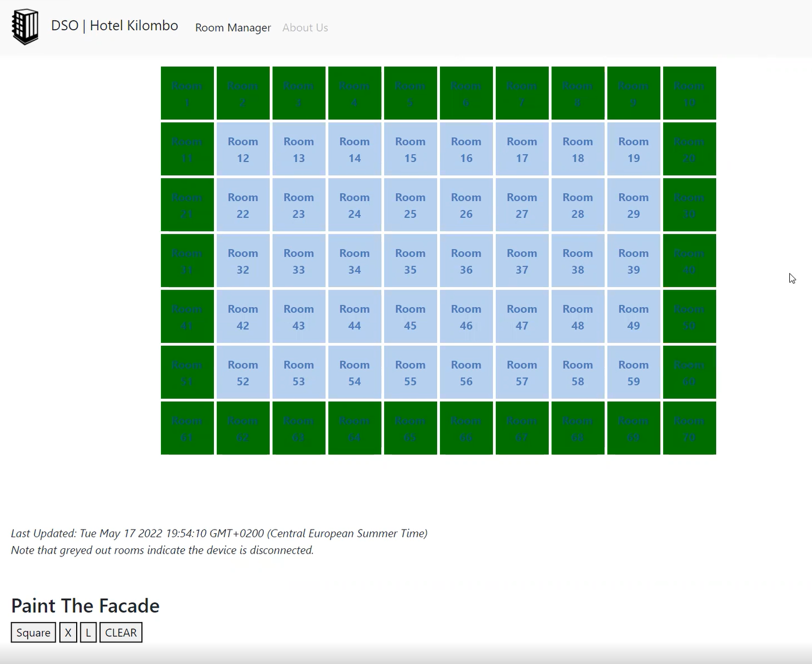
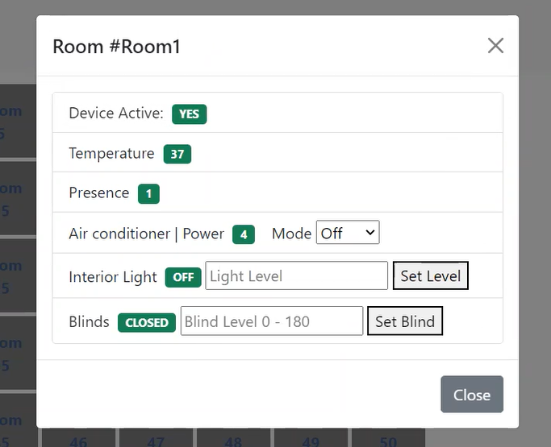
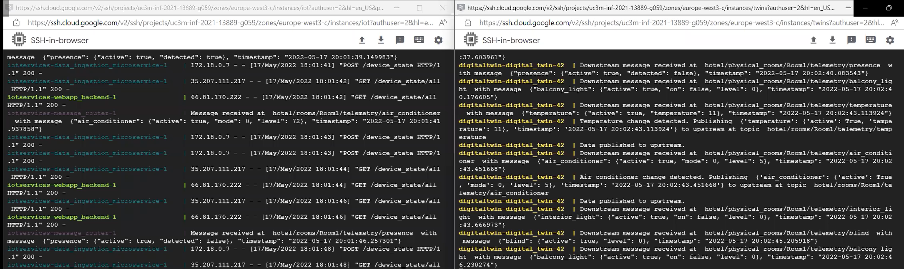

# Raspberry Pi IoT Smart Hotel

This project is a full IoT solution for running a 70 room smart hotel (well it would be a full solution if you were okay with having a raspberry pi with exposed wires sitting in your hotel room).

_Note: This project was my final submission for my IoT Design course at La Universidad Carlos III de Madrid_ 

## Features

- Raspberry Pi program to read sensors and relay commands to actuators
- Full simulator to simultaneously simulate the entire smart hotel (for lack of access to 70 raspberry pis)
- Digital twins for each rpi/simulator
- 2 MQTT message busses
    - 1 used for `pi->digital twin` communication, 1 used for `message-router` communication
- Message router to coordinate messages between the microservices
- Data microservices
    - Data Ingestion Microservice
        - Store values from the devices (both sensor and actuator states) in a time series style
    - Room Management Microservice
        - Store room states and snapshots
            - e.g. if a device connects, it will be marked as active and a snapshot of it's state is stored, and the
              same happens when it disconnects (either when the pi disconnects orderly or through the transmission of
              the last will by the MQTT broker).
    - Both interact with the MariaDB database. Though they share the same db, they have separate schemas/tables
- Frontend
    - Visualization of data, ability to send commands to each room individually
    - Ability to paint images on the facade of the hotel via coordination of various rooms' balcony lights
- Backend
    - API gateway for the frontend.

## Running

- In GCP, start the `iot` and `twins` virtual machines and open ssh windows into both
- In `iot`
    - `$ cd session13`
    - `$ bash scripts/start_iot_services.sh`
- In `twins`
    - `$ cd session13`
    - `$ bash scripts/start_digital_twins.sh` to start 4 digital twins, or
    - `$ bash scripts/start_digital_twins_full.sh` to start 70 digital twins
- Running the smart rooms
    - Raspberry Pi
        - Change the main function of `pi_implementation.py` to have your desired room number
            - `simulator = RoomDevice("Room[Your room number]")`
        - Install the required packages, including `python3 RPi.GPIO` if it's not already installed on the pi (it may
          default to the python2 version)
        - Run the file with sudo
            - `sudo python3 pi_implementation.py`
    - Simulators
        - Make sure that you are running enough digital twins to accommodate your simulated rooms
            - EX. If you are trying to run 70 rooms, you need to ensure that you've
              run `$ bash scripts/start_digital_twins_full.sh` in the `twins` vm
        - Change the global variable `NUM_DEVICES_TO_SIMULATE`
        - Run the file
            - `python3 pi_simulation.py`
- UI
    - Open the web interface, either by navigating to the public static ip of the `iot` vm, or by opening the local HTML
      file found under `frontend/index.html`
    - When devices connect, they should be un-grayed out
    - Note: Specific room values only refresh when clicking on the room again, so if you request changes and you don't
      see them reflected in the data, close the room you are inspecting, wait a few seconds, then click back in.

## Screenshots
  
  


## Project Structure

```
     .
     ├── DigitalTwin
     │   ├── README.md
     │   ├── digital_twin
VM   │   │   ├── Dockerfile
TWINS│   │   └── app
     │   │       └── digital_twin.py
     │   ├── docker-compose.yaml
     │   └── launch_instances.sh
     
     
     
     ├── IOTServices
     │   ├── MQTT-1
     │   │   ├── Dockerfile
     │   │   └── app
     │   │       └── mosquitto.conf
     │   ├── MQTT-2
     │   │   ├── Dockerfile
     │   │   └── app
     │   │       └── mosquitto.conf
     │   ├── data_ingestion_microservice
     │   │   ├── Dockerfile
     │   │   └── app
     │   │       ├── __init__.py
     │   │       ├── __pycache__
     │   │       ├── data_ingestion.py
     │   │       └── data_ingestion_api_rest.py
VM   │   ├── docker-compose.yaml
IoT  │   ├── frontend
     │   │   ├── Dockerfile
     │   │   └── app
     │   │       ├── index.html
     │   │       ├── js_lib.js
     │   │       ├── logo.png
     │   │       └── styles.css
     │   ├── mariaDB
     │   │   ├── access_db.sh
     │   │   ├── create.sql
     │   │   ├── get_all.sql
     │   │   └── setup.sql
     │   ├── message_router
     │   │   ├── Dockerfile
     │   │   └── app
     │   │       ├── __init__.py
     │   │       ├── activator.py
     │   │       └── message_router.py
     │   ├── rooms_management_microservice
     │   │   ├── Dockerfile
     │   │   └── app
     │   │       ├── rmm.py
     │   │       └── rmm_api.py
     │   └── webapp_backend
     │       ├── Dockerfile
     │       └── app
     │           └── webapp_backend_api.py


     ├── RPi
     │   ├── __init__.py
RPi  │   ├── abstract_rpi.py
or   │   ├── math_helpers.py
local│   ├── pi_implementation.py
     │   └── pi_simulation.py


     └── scripts
         ├── __init__.py
         ├── access_db.sh
         ├── commands
         │   ├── air_conditioner_command.sh
         │   ├── balcony_light_command.sh
         │   ├── blind_command.sh
         │   └── interior_light_command.sh
run      ├── frontend_requests
anywhere │   ├── __init__.py
         │   ├── facades
         │   │   ├── __init__.py
         │   │   ├── facade_command_generator.py
         │   │   └── square_outline_facade.sh
         │   └── get_room_info.sh
         ├── start_digital_twins.sh
         ├── start_digital_twins_full.sh
         └── start_iot_services.sh

```
